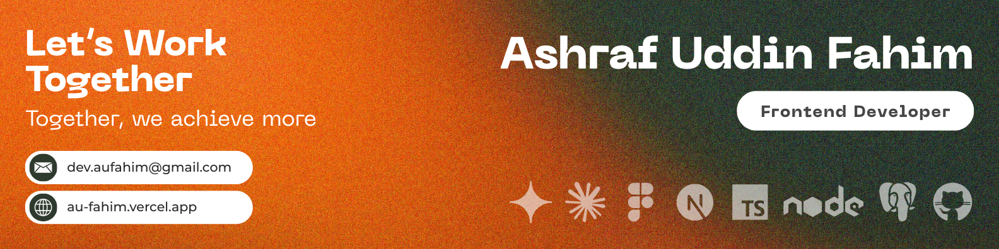

<!--- banner --->

 

<!--- title --->

  <ul align="center">
    
<h1 style="display: inline-block">Hello 👋, I'm Ashraf Uddin Fahim</h1>

    
Frontend Developer

  </ul>

 

<!--- about --->
### 👨‍💻 About Me
- 🖥️ I build clean, responsive interfaces with **React, Next.js, Tailwind CSS and TypeScript**.
- 🛠️ Currently exploring **backend tools and technologies** like **Node.js, Express.js, PostgreSQL and Prisma**.
- 🌱 I enjoy turning designs into fast, accessible, production-ready interfaces — matching pixels, smoothing out interactions, and making sure things hold up on every screen size.
- 📍 **Location:** Uttara, Dhaka, Bangladesh
- 📧 **Email:** [dev.aufahim@gmail.com](mailto:dev.aufahim@gmail.com)
- 🌐 **Portfolio:** [au-fahim.vercel.app](https://au-fahim.vercel.app/)

 

<!--- socials --->
## <b> FOLLOW ME ON SOCIALS:</b>

  

    
    
    
    
  

 

<!--- technology --->
## <b> TECHNOLOGY STACK:</b>

### Languages:

### Frontend Frameworks & Libraries:

### Backend & Database:

### Tools & Design:

 

<!--- statistics --->
## <b> GITHUB STATISTICS & ANALYSIS:</b>

### GitHub Statistics:
|  |  |
| ------------- | ------------- |

### Contribution Streak:
|  |
| ------------- |

 

<!--- random quote --->
## <b> RANDOM DEV QUOTE:</b>

---

<!--- visit count --->

  

